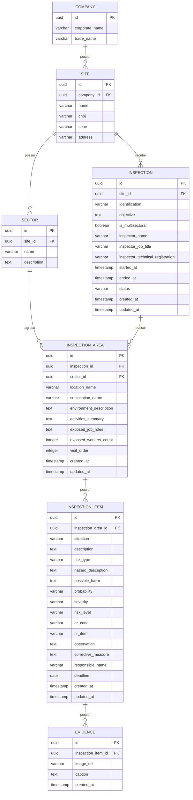

# Inspection API

API RESTful para gestão e realização de inspeções de segurança e conformidade.

## Diagrama de Entidade e Relacionamento (ERD)

## Tecnologias Utilizadas

- **Java 21**
- **Spring Boot 4**
- **PostgreSQL**
