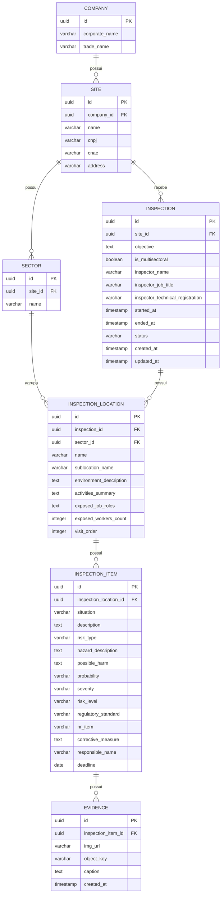

# Inspection API

API RESTful para gestão e realização de inspeções técnicas de segurança e conformidade ocupacional.

Construída com **Java 21** e **Spring Boot 4**, provê todos os recursos necessários para o aplicativo mobile registrar inspeções, locais, itens de verificação, evidências fotográficas e gerar relatórios profissionais em HTML e PDF armazenados na nuvem.

---

## Stack Tecnológica

| Tecnologia | Papel |
|---|---|
| Java | Linguagem principal |
| Spring Boot | Framework web, DI e JPA |
| SQL Server | Banco de dados relacional |
| Spring Data JPA + Hibernate | ORM e persistência |
| Lombok | Redução de boilerplate |
| SpringDoc OpenAPI | Swagger UI automático |
| Thymeleaf | Template do relatório HTML |
| OpenHTMLToPDF | Conversão HTML → PDF |
| Azure Blob Storage | Armazenamento de imagens e PDFs |

---

## Pré-requisitos

- **Java 21+** — [Adoptium](https://adoptium.net/)
- **Maven 3.9+** (ou use o wrapper `./mvnw` incluso)
- **SQL Server** — local, Docker ou Azure SQL
- **Azure Storage Account** (ou [Azurite](https://github.com/Azure/Azurite) para emular localmente)

---

## Configuração do ambiente

```bash
cp .env.example .env
```

Edite o `.env`:

```env
# SQL Server
SPRING_DATASOURCE_URL=jdbc:sqlserver://localhost:1433;databaseName=inspection_db;encrypt=false;trustServerCertificate=true
SPRING_DATASOURCE_USERNAME=sa
SPRING_DATASOURCE_PASSWORD=SuaSenha123!

# Azure Blob Storage
AZURE_STORAGE_CONNECTION_STRING=DefaultEndpointsProtocol=http;AccountName=devstoreaccount1;...
AZURE_STORAGE_CONTAINER_NAME=inspections
```

> **Dica:** Para testar sem conta Azure, use o [Azurite](https://github.com/Azure/Azurite) como emulador local.

---

## Como executar

```bash
# Clone e entre na pasta
git clone <url-do-repositorio>
cd inspection-api

# Configure o .env (veja seção acima)

# Execute
./mvnw spring-boot:run
```

A API estará disponível em **`http://localhost:8080`**.

---

## Dados de demonstração

Ao iniciar com banco vazio, o `DatabaseSeeder` popula automaticamente uma hierarquia completa para facilitar testes:

- **Empresa:** Rádio e Televisão Record S.A.
  - **Filial 1:** Sede Administrativa — Barra Funda, São Paulo/SP
    - Setores: Estúdios de Jornalismo, Redação e Ilhas de Edição, Controle Mestre, Manutenção de Transmissores, Administrativo e RH
  - **Filial 2:** Complexo de Estúdios (RecNov) — Rio de Janeiro/RJ
    - Setores: Cenografia e Marcenaria, Estúdios de Teledramaturgia, Cidade Cenográfica (Externa), Geradores e Subestação Elétrica, Acervo de Figurinos

---

## Documentação interativa (Swagger)

```
http://localhost:8080/swagger-ui.html
```

---

## Endpoints

### Inspeções — `/api/inspections`

| Método | Rota | Descrição |
|---|---|---|
| `POST` | `/api/inspections` | Criar nova inspeção |
| `GET` | `/api/inspections` | Listar inspeções (filtros: `siteId`, `status`) |
| `GET` | `/api/inspections/active-draft` | Obter rascunho ativo |
| `PUT` | `/api/inspections/{id}` | Atualizar inspeção |
| `DELETE` | `/api/inspections/{id}` | Excluir inspeção |
| `PATCH` | `/api/inspections/{id}/submit` | Finalizar e submeter inspeção |

### Locais — `.../locations`

| Método | Rota | Descrição |
|---|---|---|
| `POST` | `.../locations` | Adicionar local |
| `PUT` | `.../locations/{locationId}` | Atualizar local |
| `DELETE` | `.../locations/{locationId}` | Excluir local |

### Itens de Verificação — `.../items`

| Método | Rota | Descrição |
|---|---|---|
| `POST` | `.../items` | Adicionar item de verificação |
| `PUT` | `.../items/{itemId}` | Atualizar item |
| `DELETE` | `.../items/{itemId}` | Excluir item |

### Evidências (Fotos) — `.../evidences`

| Método | Rota | Descrição |
|---|---|---|
| `POST` | `.../evidences` | Upload de foto (`multipart/form-data`) — armazenado no Azure Blob |

### Relatórios — `/api/inspections/{id}/reports`

| Método | Rota | Descrição |
|---|---|---|
| `POST` | `.../reports` | Gerar relatório HTML + PDF e salvar no Azure Blob |
| `GET` | `.../reports` | Listar relatórios gerados |

### Empresas — `/api/companies`

| Método | Rota | Descrição |
|---|---|---|
| `GET` | `/api/companies` | Listar empresas, filiais e setores |

---

## Geração de relatório

O relatório é gerado em dois formatos a partir de um único template:

1. **HTML** — renderizado pelo Thymeleaf com dados completos da inspeção, agrupados por setor, ordenados por ordem de visita
2. **PDF** — convertido do HTML via OpenHTMLToPDF (Apache PDFBox)

Ambos são armazenados no **Azure Blob Storage** e as URLs públicas são retornadas ao app mobile.

---

## Diferenciais técnicos

- **Matriz de Risco automática** — o `RiskLevel` é calculado a partir de `Probabilidade × Severidade` (escala 1–5 × 1–5 = score 1–25), gerando quatro níveis: Baixo, Médio, Alto e Crítico, com respectivas ações recomendadas
- **Enum com semântica rica** — `InspectionSituation` e `RiskLevel` carregam label, cor e descrição, facilitando a renderização direta no relatório e no app
- **Histórico de não conformidades** — endpoint dedicado que retorna os apontamentos da inspeção anterior no mesmo local, permitindo rastreabilidade entre inspeções
- **Swagger UI completo** — toda a API é documentada automaticamente via SpringDoc OpenAPI
- **Seed de dados realista** — empresa, filiais e setores baseados em um caso real para facilitar avaliação e testes
- **Tratamento global de erros** — `GlobalExceptionHandler` padroniza todas as respostas de erro com `ErrorResponse` consistente
- **Relatório agrupado por setor** — locais são agrupados por setor e ordenados por `visitOrder` no relatório final

---

## Diagrama de Entidade e Relacionamento



---

## Estrutura do projeto

```
src/main/java/br/com/ximed/inspection_api/
├── company/          # Empresa, filial (Site) e setor — entidades e repositórios
├── config/           # DatabaseSeeder — dados iniciais automáticos
├── exception/        # GlobalExceptionHandler e exceções de domínio
├── inspection/       # Núcleo do sistema
│   ├── domain/
│   │   └── enums/    # InspectionSituation, RiskType, RiskLevel, Probability, Severity, RegulatoryStandard
│   ├── dto/          # Request e Response DTOs
│   ├── repository/   # InspectionRepository, LocationRepository, ItemRepository
│   ├── InspectionController.java
│   ├── InspectionService.java
│   └── InspectionMapper.java
├── report/           # ReportController, ReportGenerator, ReportService, ReportRepository
└── storage/          # AzureBlobService — upload e geração de URLs públicas
```
